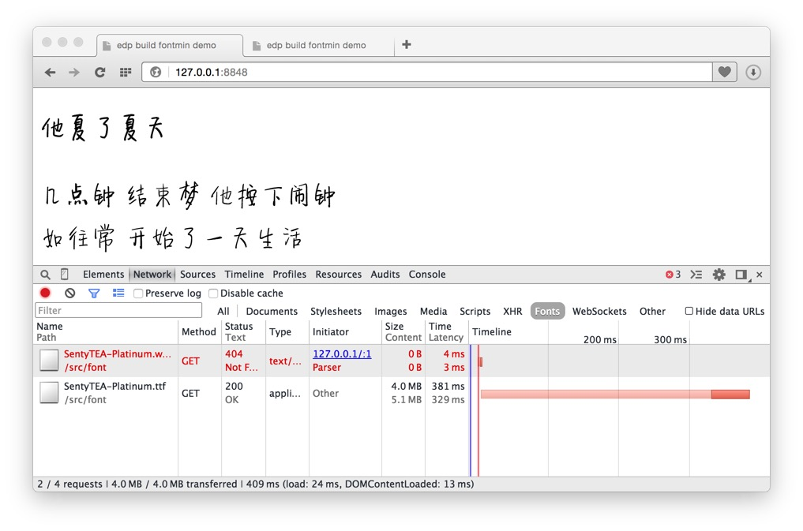

# edp-build with fontmin

> 为了让 [edp](https://github.com/ecomfe/edp) 体系的小伙伴们更快上手 [fontmin](https://github.com/junmer/fontmin) , 玩转 中文字体，创建了这个 `demo` 给大家参考

## PreInstall

```
$ npm install -g edp
```

## Useage

```
$ git clone https://github.com/junmer/edp-build-fontmin-demo
$ cd edp-build-fontmin-demo
$ npm install edp-build-fontmin
$ edp build -f
```

## Config

```
var FontProcessor = require('edp-build-fontmin');
var fontProcessor = new FontProcessor({
    files: [ '*.ttf' ],                     // 字体文件
    entryFiles: [ '*.html' ],               // 引用字体的网页，用来扫描所需字型
    text: '他夏了夏天',                      // 人肉配置所需字型
    chineseOnly: true,                      // 只取中文字型，忽略 数字、英文、标点
});
```

## Showcase

```
$ edp ws start
```

打开 `http://127.0.01:8848/` 和 `http://127.0.01:8848/output/` 对比效果

构建前:



构建后:


字体文件 `5.1 MB` -> `29.1 KB`, 效果 萌萌哒  (￣y▽￣)~*

## Related

- [edp](https://github.com/ecomfe/edp)
- [fontmin](https://github.com/junmer/fontmin)
- [edp-build-fontmin](https://github.com/junmer/edp-build-fontmin)
- [fonteditor](https://github.com/ecomfe/fonteditor)

## Thanks

- [新蒂下午茶体 白金版](http://font.sentywed.com/download.htm) 非商业免费授权，商业授权请联系 [新蒂字体](http://font.sentywed.com/)
